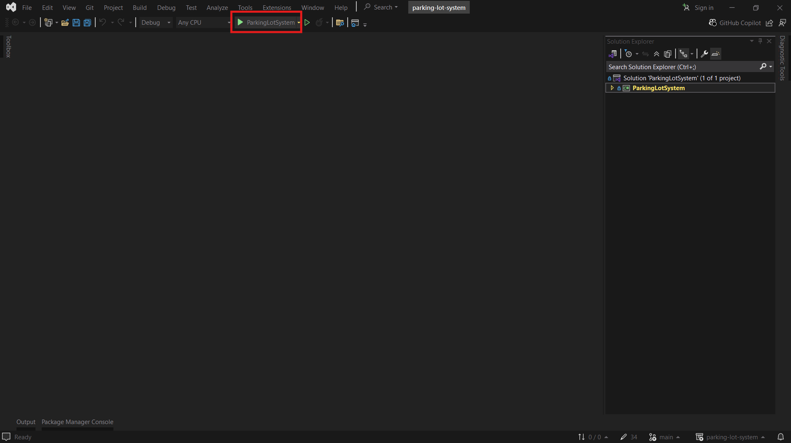
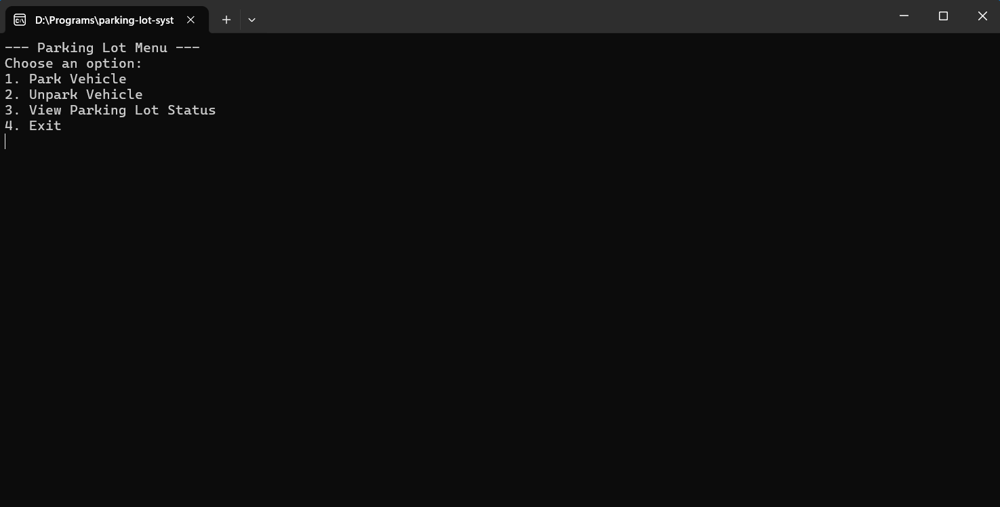
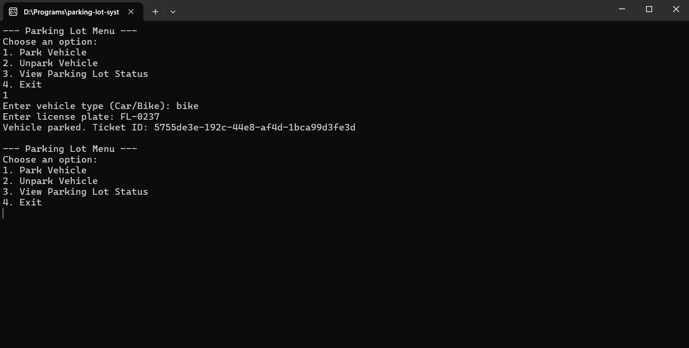
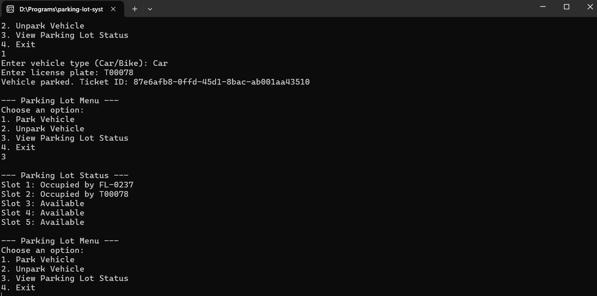
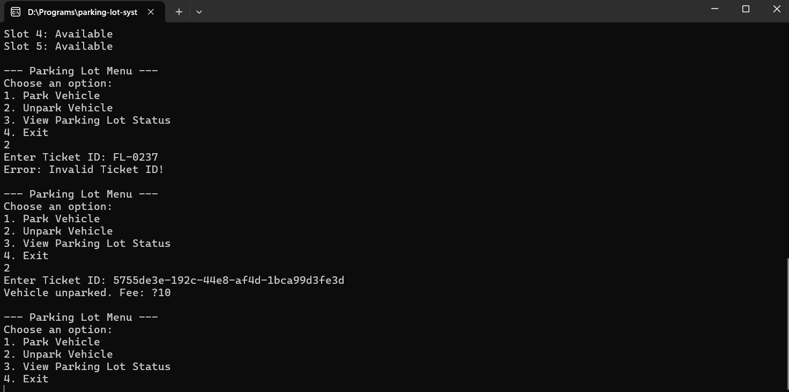

    <h1>Parking Lot Management System</h1>
    <h4>A simple console-based C# application for Parking Lot Management System</h4>
     

    

    
Content List

    <ul>
        <li>
        <a href="#about-the-project">About The Project</a>
        <ul>
            <li><a href="#built-with">Built With</a></li>
        </ul>
        </li>
        <li>
        <a href="#getting-started">Getting Started</a>
        <ul>
            <li><a href="#requirements">Requirements</a></li>
            <li><a href="#installation">Installation</a></li>
        </ul>
        </li>
        <li><a href="#snapshots">Snapshots</a></li>
    </ul>
    

    <h2><u>About the Project</u></h2>
    
This project is a simple console-based Parking Lot Management System developed in C#. It allows users to simulate the operations of a small parking facility with a limited number of parking slots.

    <h3>Key Features:</h3>
    <ul>
        <li><b>Vehicle Parking:</b> Supports two types of vehicles – Cars and Bikes. Users can enter vehicle details to park and receive a unique ticket ID.</li>
        <li><b>Vehicle Unparking:</b> Users can unpark their vehicle using the ticket ID and view the calculated parking fee.</li>
        <li><b>Status Display:</b> Shows current parking lot occupancy and available slots.</li>
        <li><b>Exception Handling:</b> Gracefully handles errors such as invalid input or ticket misuse.</li>
    </ul>
    

        <h3>Built with:</h3>
        <ul>
            <li>Language: C#</li>
            <li>Architecture: Object-Oriented Programming (OOP)
        </ul>
    

    <h2><u>Getting Started</u></h2>
    

        <h3>Requirements:</h3>
        <ul>
            <li>IDE: Visual Studio 2022</li>
            <li>OS: Windows 11</li>
            <li>Internet Connection</li>
        </ul>
    

        <h3>Installation: </h3>
        <ol>
            <li>Download the project repository</li>
            <li>Open the <i>ParkingLotSystem.sln</i> with Visual Studio 2022</li>
        </ol>
    

    

    <h2><u>Snapshots</u></h2>
    
    
    
    
    

